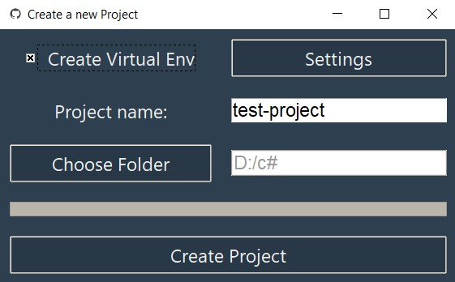

# Automatic Project Creation
> This is a simple tkinter app wich initializes a git repository and pushes it to Github. Optionally it creates a virtual environment as well.

## Prerequisites
To run this program you should have **git** and **python** installed correctly on your systems.

* [Python](https://www.python.org/downloads/)

* [Git](https://git-scm.com/downloads)



## Installation

> Follow these steps to setup the application:
Start by cloning the repository and cd'ing into it:
```
git clone && cd create-project
```


Continue by creating a new virtual environment (optional, but just do it):
```
python -m venv venv
```
Now activate it.<br>
Windows:
```sh
venv\Scripts\activate.bat
```
Mac\Linux
```sh
source venv\Scripts\activate
```
Install the requirements:
```
pip install -r requirements.txt
```
## Start using the application

To use the application you should excute this command:
```sh
python app.py
```
Nice! You actualy got the app running but in order to start using it there are still a few steps to complete.<br>
In the app, open up the settings frame and fill in your username/email and password.

Optionally, you can change the name that will be used for Virtual environments.

Your all set and ready to go!
## Contributing

1. Fork it (<https://github.com/sebastianvdn/create-project/fork>)
2. Create your feature branch (`git checkout -b feature/fooBar`)
3. Commit your changes (`git commit -am 'Add some fooBar'`)
4. Push to the branch (`git push origin feature/fooBar`)
5. Create a new Pull Request

<!-- Markdown link & img dfn's -->
[npm-image]: https://img.shields.io/npm/v/datadog-metrics.svg?style=flat-square
[npm-url]: https://npmjs.org/package/datadog-metrics
[npm-downloads]: https://img.shields.io/npm/dm/datadog-metrics.svg?style=flat-square
[travis-image]: https://img.shields.io/travis/dbader/node-datadog-metrics/master.svg?style=flat-square
[travis-url]: https://travis-ci.org/dbader/node-datadog-metrics
[wiki]: https://github.com/yourname/yourproject/wiki
